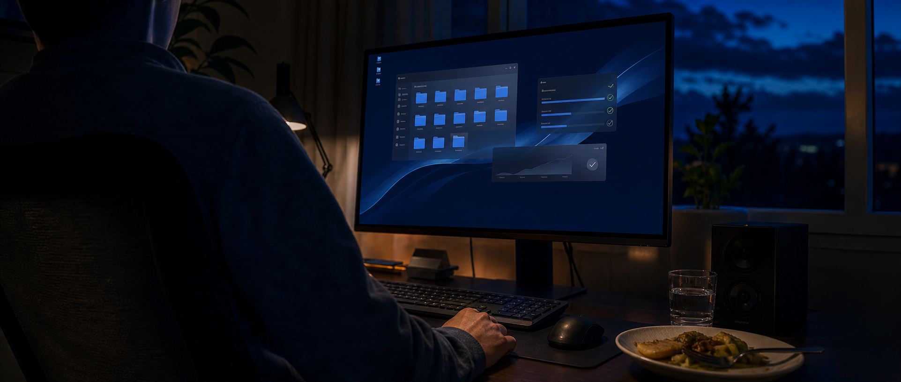

# DeskBox 1.4.8 发布了，我重新想了想“信任”这件事

刚刚，DeskBox 1.4.8 发出去了。

今天是周六，我还在公司处理本职工作的加班。晚上回到家，饭都没来得及吃，我先打开电脑，把准备发布的版本重新验证了一遍。一直到刚才，两个架构的安装包都确认没有问题，1.4.8 才终于发布。

按下发布以后，我才算真正松了一口气。

这一天有些坎坷。准确地说，是从昨晚开始的。前一个晚上，我一直做到凌晨四点。那时 1.4.6 已经发布，但我没有马上睡觉，而是把 DeskBox 里所有涉及文件移动、复制和删除的流程重新走了一遍。

因为对用户来说，文件永远是最重要的。

这两天连续发布了几个版本，表面上看只是版本号从 1.4.5 走到了 1.4.8。对我来说，它更像一次提醒。DeskBox 已经不是我自己电脑上的小工具了。越来越多的人开始真正使用它，也愿意表达喜欢、提出建议，甚至在出现问题以后仍然给我理解。

这份理解没有让我更轻松，反而让我觉得，自己应该再认真一点。

## 它的起点，只是我想给自己找一个工具

我用了很多年腾讯桌面管家，同类软件也试过不少。功能大多够用，但界面往往还停留在很多年前的 Windows 风格里。我一直很喜欢微软这些年的原生设计语言，想找一个看起来像系统本身一部分的桌面整理工具。找了很久，没有找到真正合适的。

那时候 AI 编程刚刚变得可用。我的本职是产品经理，会一点 Python 和 SQL，C# 和 Rust 基本没有接触过。我就想，要不自己试一次，让 AI 帮我把脑子里的东西做出来。

第一版很简单，只做一件事，把桌面上的文件收进格子里。但它的样子，就是我当时想象中的样子。我自己每天用，用着用着，觉得应该有待办，应该有剪贴板记录，后来又有了随记、天气和音乐控制。功能就这样一点点长了出来。

那段时间 DeskBox 没有什么完整的产品计划，我自己的需求就是路线图。自己用得上，就值得做。

后来我在公众号随手写了一篇文章介绍它，五千多人看了，GitHub 很快有了三百多个 Star。说实话，我那时完全不知道该怎么维护一个公开项目。只能有人提问就回答，出现问题就修。现在回头看，那是 DeskBox 第一次被迫营业。

[配图占位  DeskBox 早期版本与当前版本对比]

## 一觉醒来，99+ 条未读

做到 1.4.2 的时候，有天晚上我顺手在 B 站传了一段演示视频。视频是当晚录的，没有剪辑，讲话也不算利索，我只是想让大家看看这个软件是什么样子。

那段视频后来有了大约十四万播放。

GitHub Star 涨到一千六百多，Issues 超过一百个。有天早上醒来，未读消息 99+。高兴是真的，慌也是真的。有人在评论区反馈问题，有人在群里提建议，还有朋友专门整理了一份飞书文档，把发现的问题一条一条列了出来。

其中被提起最多的是性能。

桌面工具需要常驻。任务管理器里的数字一大，用户心里难免会打鼓，这个软件一直开着，到底靠不靠谱。如果动画不跟手，一个原本用来提高效率的工具，反而成了每天都要忍受的负担。

还有一个问题比性能更让我在意。有用户卸载 DeskBox 以后，发现原来桌面上的文件不见了，以为文件被软件删除了。文件其实还在，只是已经被移进收纳目录。但站在用户的角度，桌面上的东西突然找不到，感受到的就是文件丢了。

“文件还在”这句话，在这种时候没有太大意义。软件既然移动了用户的文件，就应该让人清楚地知道它们去了哪里，卸载之后又该怎么找到。现在 DeskBox 会在桌面保留一个独立的收纳目录入口，卸载时如果里面还有文件，也会再提醒用户。这个改动不复杂，却是我现在最在意的事情之一。

因为整理桌面的软件最不能消耗的，就是用户对文件安全的信任。

还有一位用户让我印象很深。他平时不用 Microsoft Store，却为了支持 DeskBox，专门去商店付费下载了一次，然后卸载商店版，继续使用 GitHub 版本。

商店版和 GitHub 版功能完全相同，没有任何独占内容。它只是给愿意支持这个项目的人留了一个入口。真的有人愿意这样支持我，我很感动。感动之后，更多的是压力，因为我知道版本里仍然有许多来不及处理的问题。

DeskBox 已经被一部分人真实地用起来了。既然发了出去，用户的文件、花在软件上的时间，以及他们给我的信任，我都要认真对待。

[配图占位  B 站播放量、GitHub Star 与用户反馈截图]

## 用的人多了，我反而更想做减法

用户多了，需求也多了。有人想要股票，有人需要新闻和视频，也有人提议做浏览器。客观地说，每个需求单独拿出来，都有成立的场景。

但我一直在克制。

如果全部做进来，DeskBox 最后会变成一个什么都能放的容器。安装体积、内存占用和设置复杂度一起上涨，到最后连它自己是什么都说不清楚。一个桌面整理工具，不能靠不断堆功能来证明价值。

文件、待办、随记、音乐这些大多数人会用到的功能，会继续留在本体里。更长尾的需求，我仍然倾向于交给未来的插件机制。需要什么就安装什么，不使用的人不必承担额外的体积和开销。这个方向还在思考，没有时间表。

我现在更希望 DeskBox 是轻的，少占一些资源，也少打扰一点。需要的时候它在，不需要的时候，它安静待着。

当然，不是所有人都会认同。有人觉得这类软件没有价值，只是在消耗 Token；有人觉得桌面整理只要能收纳文件就够了，后面的功能都是负担；也有人只想要一个简单的文件框。这些想法我都能理解。

做产品不可能让所有人满意。我只能保留自己的判断。只要有一群人愿意长期使用它，这件事就值得继续。

## 为了性能，我确实冒了不少风险

最近一个多月，我把很大一部分时间用在了性能优化上。

性能是一个很矛盾的问题。有人盯着任务管理器，希望常驻内存越低越好；也有人在意响应速度，希望格子一点就开，动画任何时候都不能卡。想节省内存，就要更积极地释放界面和缓存；释放以后，下次打开又要重新加载。这两个目标天然会拉扯。

所以我没有替所有人做同一个决定，而是提供了均衡、节省资源和自定义模式。想压低占用，可以更积极地回收；更在意响应速度，就多保留一些内容。

但性能优化不是单纯地删几个缓存。它会碰到窗口生命周期、动画、图片、文件刷新和各种后台任务。很多代码原本已经稳定运行，重新调整以后，就可能在某个意想不到的地方产生连锁反应。

1.4.5 上线之前，我心里其实做过评估。我知道这次改动范围很大，也知道为了性能确实冒了不少风险。我尽可能补测试、反复验证，最后认为风险已经可以接受，才决定发布。

但评估永远只能覆盖已经想到的场景。Windows 电脑上的系统版本、显示器、显卡驱动、权限设置和第三方扩展太复杂了，同一段逻辑在我的机器上一切正常，换到另一台电脑上，可能就会出现一种我从没见过的结果。

独立开发最困难的地方，有时不是把功能做出来，而是你永远不知道，还有哪台电脑正在等着给你上一课。

[配图占位  性能与资源设置，以及不同模式下的说明]

## 发出去，撤回来，再继续验证

1.4.5 发布以后，很快出现了一个问题。在部分系统上，把 `.lnk` 快捷方式从一个格子拖到另一个位置时，原来的快捷方式会被误删，并进入回收站。

它删除的是快捷方式，不是快捷方式指向的原文件，实际影响相对有限。反馈问题的朋友大多也表示了理解。但我还是很自责。

因为这件事碰到了 DeskBox 最不应该碰的边界。影响大小是一回事，软件有没有在用户不知道的情况下动错文件，是另一回事。

原因后来查清楚了。拖放结束时，DeskBox 过早地告诉系统这是一次移动，系统便按照移动的规则清理源位置，把还没有完成搬运的快捷方式送进了回收站。修复以后，DeskBox 会等文件真正完成搬运，再向系统确认这次操作的结果。

于是 1.4.5 撤了下来，修复后以 1.4.6 重新发布。

1.4.6 发出去以后，我没有马上去睡。那时候已经接近凌晨四点，我把所有涉及文件移动、复制和删除的流程重新走了一遍。我需要确认文件从哪里来，最后去了哪里，失败时会留下什么，DeskBox 又会怎样告诉系统这次操作的结果。

全部重新确认没有问题以后，我才关掉电脑。第二天是周六，我还要去公司加班。那一觉睡得并不踏实。

白天正常处理本职工作，晚上回到家，饭还没吃，我又打开了 DeskBox。1.4.6 发布以后，陆续还有用户反馈一些小问题。它们没有快捷方式误删那么严重，但我已经不太敢用“应该没问题”来说服自己。

后面又经历了 1.4.7，直到刚刚，1.4.8 才真正发出去。中间重新构建了两个架构的安装包，也把能想到的风险又过了很多轮。

它当然还不完美。还有许多细节可以继续调整，也一定会有我现在还没有覆盖到的电脑和使用方式。但至少在这一刻，我确认已经没有自己明知存在却没有处理的风险，才按下了发布。

然后我终于松了一口气。

[配图占位  1.4.5 撤回、1.4.6 至 1.4.8 发布记录或构建验证结果]

## 一个不会 C# 的产品经理，怎么对软件负责

DeskBox 从第一天起就是免费开源的。

理由并不复杂。我一直受益于那些免费开放的工具，其中不少具备足够的商业价值，作者依然选择把代码公开。我始终觉得这是很了不起的做事方式。轮到自己时，开源是一个很自然的选择。

这个软件也确实是通过 AI 编程做出来的。我是产品经理，会一点 Python 和 SQL。在这个项目之前，C# 和 Rust 的语法我都没有完整看过。大量代码由 AI 完成，是它让我脑子里的界面真正运行了起来。这一点，我很感谢它。

但代码能运行，只是一天工作的开始。

我的大部分时间花在别的地方。这个按钮放在这里，用户会不会凭直觉点对；文件被移动以后，怎样才能让人放心；哪些需求应该做，哪些不该做；发现风险以后，是按计划发布，还是停下来重新检查。这些判断不能交给 AI，测试、回归和发布以后的责任，也只能由我承担。

我平时晚上八点下班，坐一小时公交回家，然后继续做 DeskBox，常常到夜里一点以后才休息。这个状态持续了挺久，我老婆说我 Codex 中毒了。

我倒没有想过放弃。被批评会难受，版本出现问题会自责，但第二天打开电脑，还是要先把能复现的问题复现出来，再一点点把逻辑理顺。

网上也有人说，AI 做的产品，有什么资格开源。

我的理解是，开源首先意味着任何人都可以检查 DeskBox 对电脑做了什么，文件和数据是怎样被处理的。AI 给了我把想法变成产品的能力，但用户是否愿意把它留在电脑上，最终取决于它能不能解决问题，以及出了问题以后，有没有人继续负责。

[配图占位  GitHub 仓库页面与 Microsoft Store 支持入口]

## 写在 1.4.8 发布之后

做 DeskBox 以前，我对“用户信任”这几个字的理解其实很抽象。软件不上传数据、不做恶意操作、把隐私写清楚，好像就算完成了。

真正有人使用以后，我才发现，信任藏在许多更具体的地方。移动一个文件之前有没有说明，失败以后有没有留下退路，卸载之后用户还能不能找到自己的东西，遇到问题时有没有人认真回复。甚至一个很小的操作不顺手，积累久了，也会让人怀疑这个软件是不是值得继续使用。

我很感谢那些愿意使用 DeskBox、表达喜欢、提交问题，甚至在版本出错以后仍然给我理解的用户。正因为这样，我不能把这份理解当作犯错以后理所当然的缓冲。

DeskBox 接下来不会突然变成一个什么都能做的软件。性能可以慢慢优化，功能细节可以一点点补，使用中不顺手的地方也可以一个个处理。它只需要比上一个版本更稳一点、更顺手一点，同时不拿用户的文件去冒险。

我知道 1.4.8 发出去以后，明天可能还会出现新的问题。Windows 的环境太复杂，一个人和几台电脑永远覆盖不完。但至少今晚，我把自己能想到的风险重新走了一遍，也确认这个版本已经到了可以交给用户的程度。

现在，我终于可以先去吃这顿迟到的晚饭了。

[DeskBox GitHub 项目](https://github.com/Tianyu199509/DeskBox)

[DeskBox 官方网站](https://deskbox.fun)
